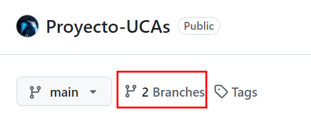

# Proyecto UCA`s Conectadas plus.

En este proyecto lo que se busca es crear un entorno donde las personas asociadas a las UCA puedan realizar pedidos de mensajería y paquetería, entre miembros de las UCA o con miembros asociados a la red de distribución, sin la necesidad de que un mensajero pase por sus residencias para comprobar si tienen que pedidos disponibles. Este proyecto va a mejorar la eficiencia de los portadores y los tiempos de espera para la llegada de los paquetes para los miembros.

(Lo base en un juego __"Death Stranding"__)

## Comandos usados para la creación de la rama vercion1

```code
bae2@jpexposito-VirtualBox:~/repositorios/prueba-1$ git pull origin main 
Desde https://github.com/eduardosmoralesglez/prueba-1
 * branch            main       -> FETCH_HEAD
Actualizando 1774d8f..9164686
Fast-forward
 README.md | 6 ++++--
 1 file changed, 4 insertions(+), 2 deletions(-)
bae2@jpexposito-VirtualBox:~/repositorios/prueba-1$ cat README.md 
# Proyecto UCA`s Conectadas plus.

En este proyecto lo que se busca es crear un entorno donde las personas asociadas a las UCA puedan realizar pedidos de mensajería y paquetería, entre miembros de las UCA o con miembros asociados a la red de distribución, sin la necesidad de que un mensajero pase por sus residencias para comprobar si tienen que pedidos disponibles. Este proyecto va a mejorar la eficiencia de los portadores y los tiempos de espera para la llegada de los paquetes para los miembros.

(Lo base en un juego __"Death Stranding"__)
bae2@jpexposito-VirtualBox:~/repositorios/prueba-1$ ls
img  README.md
bae2@jpexposito-VirtualBox:~/repositorios$ sudo mv prueba-1/ proyecto-UCAs
```

---

```code
bae2@jpexposito-VirtualBox:~/repositorios/proyecto-UCAs$ git checkout -b version-1
Cambiado a nueva rama 'version-1'
bae2@jpexposito-VirtualBox:~/repositorios/proyecto-UCAs$ git branch 
  main
* version-1
bae2@jpexposito-VirtualBox:~/repositorios/proyecto-UCAs$ 
```

---

```code
bae2@jpexposito-VirtualBox:~/repositorios/proyecto-UCAs$ git push -u origin version-1 
Username for 'https://github.com': eduardosmoralesglez
Password for 'https://eduardosmoralesglez@github.com': 
Total 0 (delta 0), reusados 0 (delta 0), pack-reusados 0
remote: This repository moved. Please use the new location:
remote:   https://github.com/eduardosmoralesglez/Proyecto-UCAs.git
remote: 
remote: Create a pull request for 'version-1' on GitHub by visiting:
remote:      https://github.com/eduardosmoralesglez/Proyecto-UCAs/pull/new/version-1
remote: 
To https://github.com/eduardosmoralesglez/prueba-1
 * [new branch]      version-1 -> version-1
Rama 'version-1' configurada para hacer seguimiento a la rama remota 'version-1' de 'origin'.
bae2@jpexposito-VirtualBox:~/repositorios/proyecto-UCAs$ 
```

---

```code
bae2@jpexposito-VirtualBox:~/repositorios/proyecto-UCAs$ git branch -r
  origin/HEAD -> origin/main
  origin/main
  origin/version-1
bae2@jpexposito-VirtualBox:~/repositorios/proyecto-UCAs$ 
```

---

```code
bae2@jpexposito-VirtualBox:~/repositorios/proyecto-UCAs$ git status 
En la rama version-1
Tu rama está actualizada con 'origin/version-1'.

Cambios no rastreados para el commit:
  (usa "git add <archivo>..." para actualizar lo que será confirmado)
  (usa "git restore <archivo>..." para descartar los cambios en el directorio de trabajo)
	modificados:     README.md

Archivos sin seguimiento:
  (usa "git add <archivo>..." para incluirlo a lo que será confirmado)
	img/empthy

sin cambios agregados al commit (usa "git add" y/o "git commit -a")
bae2@jpexposito-VirtualBox:~/repositorios/proyecto-UCAs$ git add .
bae2@jpexposito-VirtualBox:~/repositorios/proyecto-UCAs$ git status 
En la rama version-1
Tu rama está actualizada con 'origin/version-1'.

Cambios a ser confirmados:
  (usa "git restore --staged <archivo>..." para sacar del área de stage)
	modificados:     README.md
	nuevos archivos: img/empthy

bae2@jpexposito-VirtualBox:~/repositorios/proyecto-UCAs$ git commit -m "Inicio de la versión 1 del proyecto"
[version-1 5d4a638] Inicio de la versión 1 del proyecto
 2 files changed, 71 insertions(+)
 create mode 100644 img/empthy
bae2@jpexposito-VirtualBox:~/repositorios/proyecto-UCAs$ 
```

---

```code
bae2@jpexposito-VirtualBox:~/repositorios/proyecto-UCAs$ git branch -r
  origin/HEAD -> origin/main
  origin/main
  origin/version-1
bae2@jpexposito-VirtualBox:~/repositorios/proyecto-UCAs$ git push
Username for 'https://github.com': eduardosmoralesglez
Password for 'https://eduardosmoralesglez@github.com': 
Enumerando objetos: 8, listo.
Contando objetos: 100% (8/8), listo.
Compresión delta usando hasta 4 hilos
Comprimiendo objetos: 100% (4/4), listo.
Escribiendo objetos: 100% (5/5), 1.32 KiB | 1.32 MiB/s, listo.
Total 5 (delta 0), reusados 0 (delta 0), pack-reusados 0
remote: This repository moved. Please use the new location:
remote:   https://github.com/eduardosmoralesglez/Proyecto-UCAs.git
To https://github.com/eduardosmoralesglez/prueba-1
   9164686..5d4a638  version-1 -> version-1
bae2@jpexposito-VirtualBox:~/repositorios/proyecto-UCAs$ 
```

---



---

```code
bae2@jpexposito-VirtualBox:~/repositorios/proyecto-UCAs$ git branch 
  main
* version-1
bae2@jpexposito-VirtualBox:~/repositorios/proyecto-UCAs$ git checkout main 
Cambiado a rama 'main'
Tu rama está actualizada con 'origin/main'.
bae2@jpexposito-VirtualBox:~/repositorios/proyecto-UCAs$ git merge version-1 
Actualizando 9164686..5d4a638
Fast-forward
 README.md  | 71 +++++++++++++++++++++++++++++++++++++++++++++++++++++++++++++++++++++++
 img/empthy |  0
 2 files changed, 71 insertions(+)
 create mode 100644 img/empthy
bae2@jpexposito-VirtualBox:~/repositorios/proyecto-UCAs$ git push
Username for 'https://github.com': eduardosmoralesglez
Password for 'https://eduardosmoralesglez@github.com': 
Total 0 (delta 0), reusados 0 (delta 0), pack-reusados 0
remote: This repository moved. Please use the new location:
remote:   https://github.com/eduardosmoralesglez/Proyecto-UCAs.git
To https://github.com/eduardosmoralesglez/prueba-1
   9164686..5d4a638  main -> main
bae2@jpexposito-VirtualBox:~/repositorios/proyecto-UCAs$ 
```
